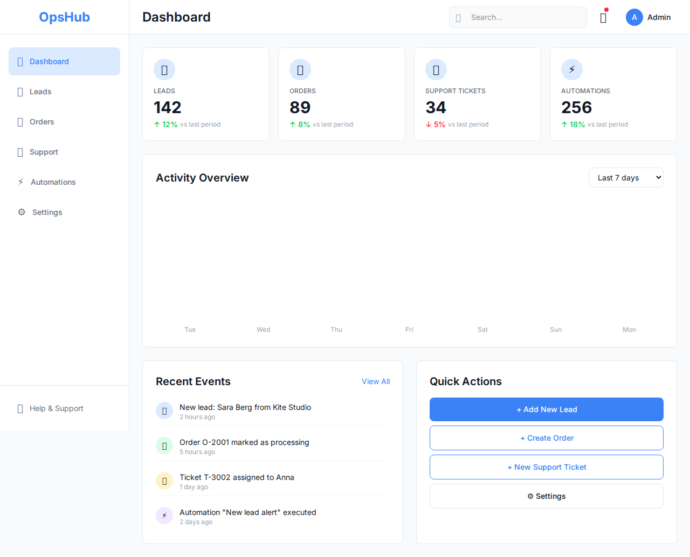
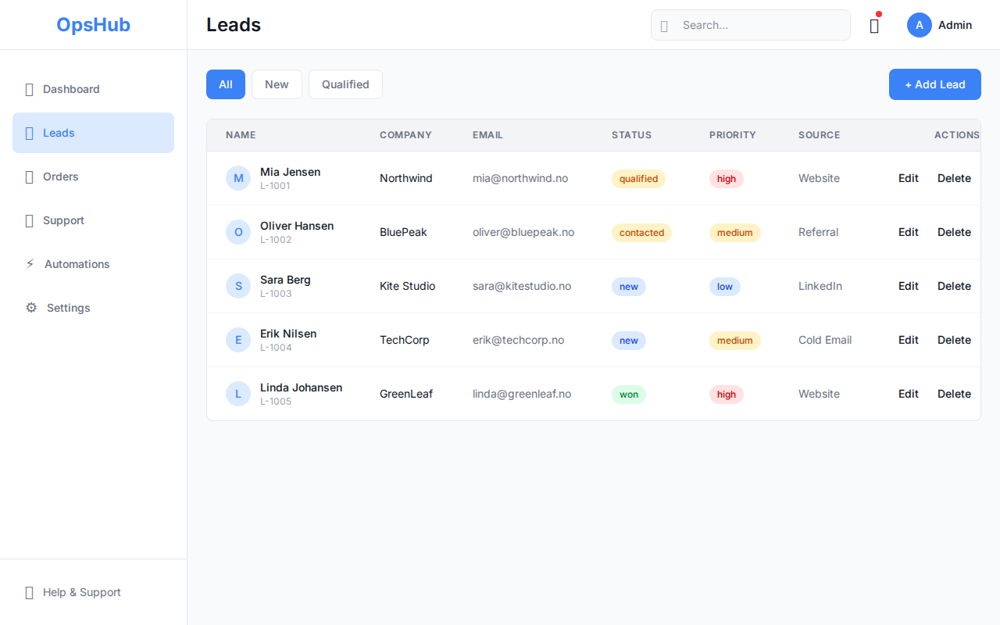
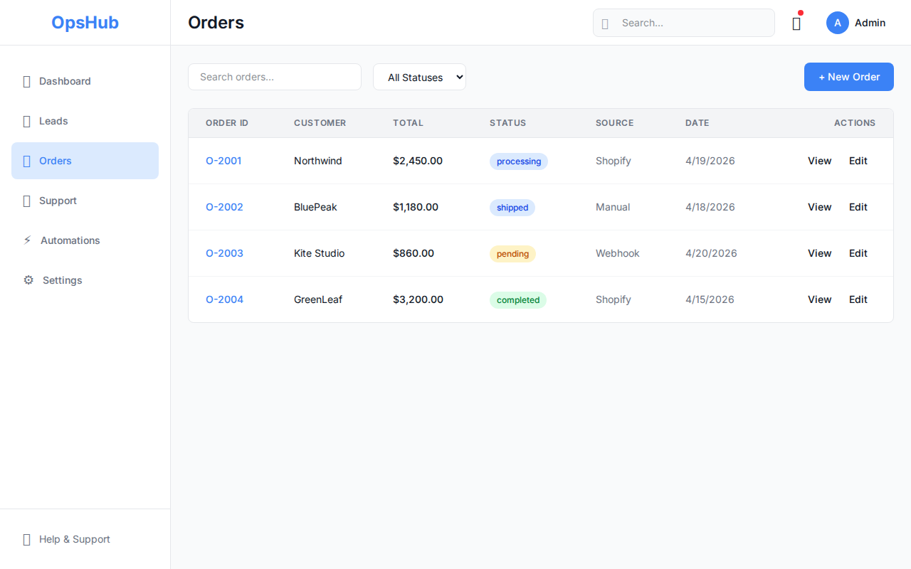
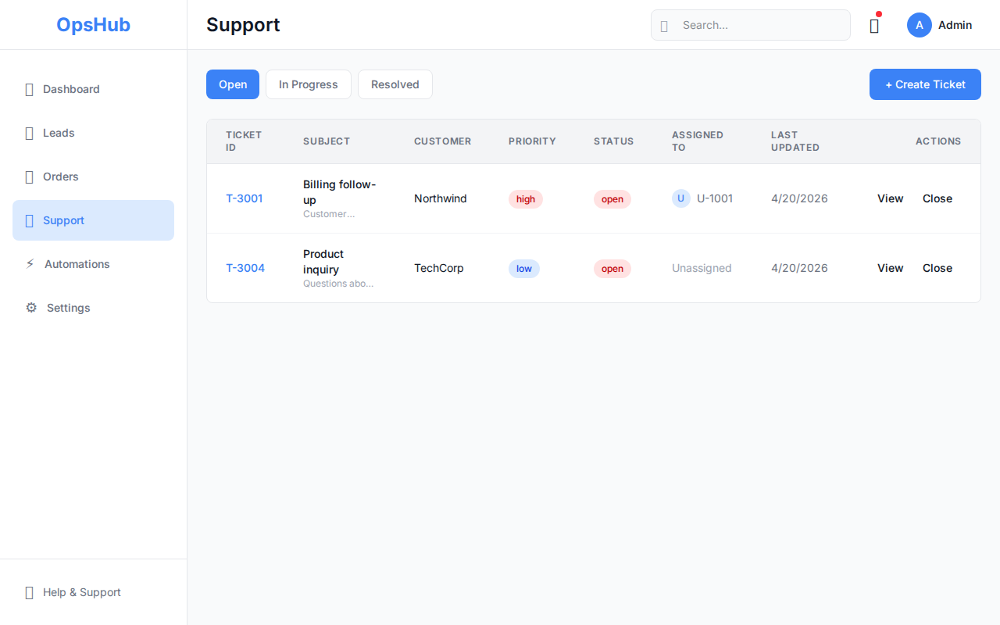
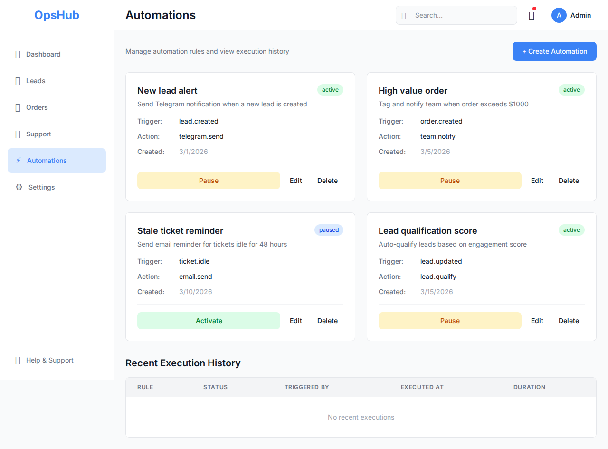
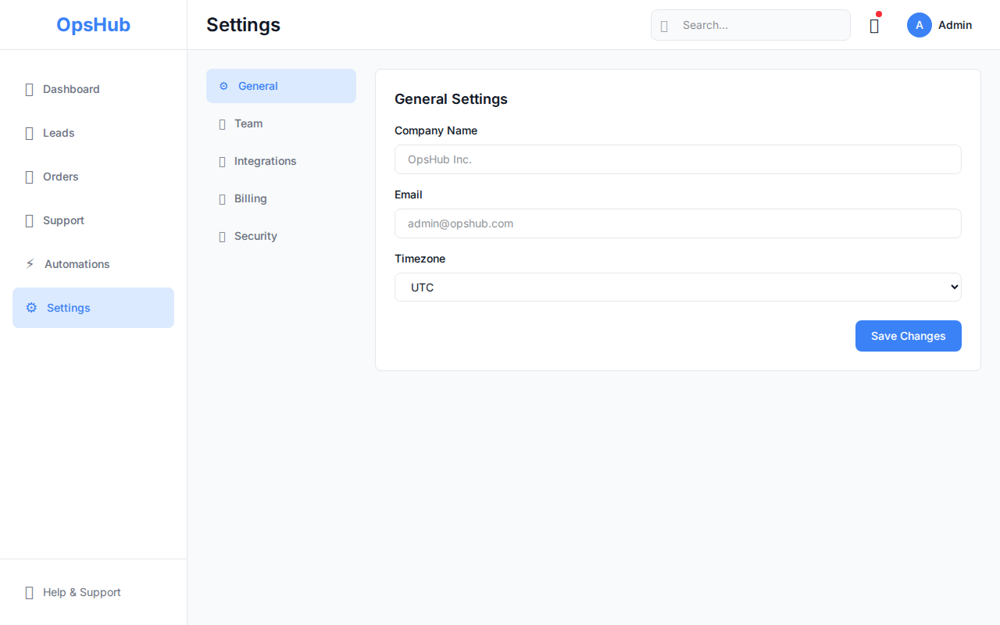

# OpsHub

OpsHub is a frontend prototype for a small-business operations dashboard — built to demonstrate UI architecture, component design, and responsive layout with Next.js and Tailwind.

This project is intentionally presented as a clean, well-structured frontend showcase, not a production-ready product. It includes mock data, placeholder interactions, and API routes that return sample responses to illustrate how a full build could be organized.

## Pages

- **Dashboard** — KPI cards and an activity feed
- **Leads management**
- **Orders tracking**
- **Support tickets**
- **Automations**
- **Settings**

## Tech stack

- Next.js 14
- TypeScript
- Tailwind CSS

## Screenshots








## Getting started

```bash
npm install
npm run dev
```

Then open:

```bash
http://localhost:3000
```

## Data and API behavior

- API routes return mock/sample data
- UI behavior is based on demo interactions and placeholder content
- The app is meant to show what a full operations dashboard build could look like

## License

MIT
